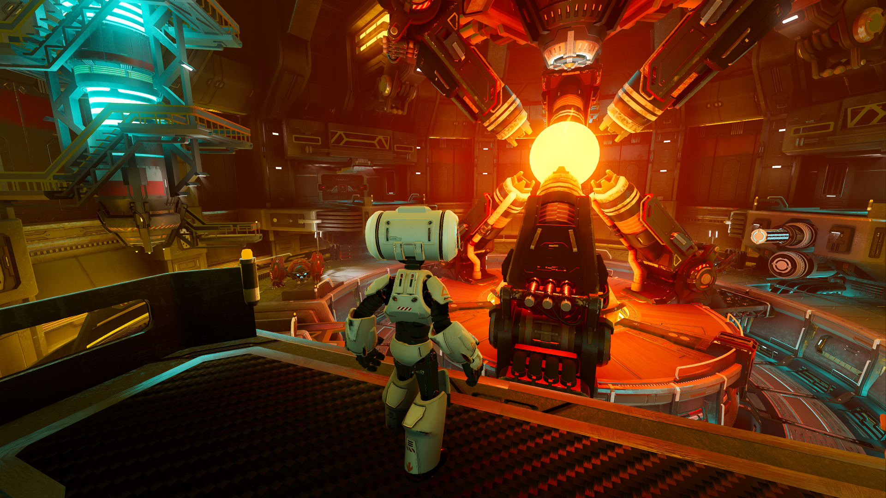

# Third Person Shooter Demo

Third person shooter demo made using [Godot Engine](https://godotengine.org).

Check out this demo on the asset library: https://godotengine.org/asset-library/asset/678



## Overview

Starting from the original Godot TPS demo, this project grows it into a small
third-person shooter sandbox. At a high level it offers:

- **Menu-driven flow** — a main menu leads to character selection, a level
  picker, a settings screen, a developer screen, and online play.
- **Playable characters** — selectable player variants that move, aim, jump and
  shoot, with first-person camera control and a local health HUD.
- **Enemies** — a ground enemy (Red Robot) that approaches, aims and fires a
  laser, and a flying bomber (Criatura Alada) that orbits the player and drops
  bombs.
- **Localized damage** — per-limb native 3D colliders (head, torso, arms, legs)
  sized to each character's mesh, so hits to different body parts deal different
  damage (headshots deal extra). Both bullets and the enemy laser respect them.
- **Multiple levels** — a simple arena (Level 1), a bomber encounter (Level 2),
  a full complex level (Level Base), plus online (host/connect) play.
- **3D model library + viewer** — reusable 3D assets organized by type under
  `library3D/`, browsable in-game through the Models screen (category → model →
  part) with toggles for rotation, animation, **Audio** (every non-speech sound:
  movement, motor, shots…), **Falas** (speech/scream emitters only) and colliders.
  Each toggle is the master switch for its category (no sound/animation plays while
  its toggle is off, regardless of the dropdown — including sound driven by animation
  tracks) and the toggle states are persisted between visits. The "Animação" dropdown
  appears only for the assembled "Modelo completo" view. Drag to hand-rotate the model
  up to 180° on both axes (left/right and up/down).
- **Cyberpunk HUD & 2D widgets** — a set of reusable UI controls (HUD, minimap,
  vitals, crosshair, pause menu, scanlines, and more).
- **Debug tooling** — a debug overlay (FPS HUD, ground grid, and per-node
  TYPE/ID tooltips on 2D and 3D nodes), toggled from the developer screen and the
  settings "Debug" tab.
- **Audio settings** — the settings "Audio" tab has independent controls for
  background **Música** (the `Music` bus) and **Efeitos de Som** (the `SFX` bus,
  which the `Outside`/`Reactor` gameplay buses route into), each saved and applied
  globally.

## Godot versions

- The [`master`](https://github.com/godotengine/tps-demo) branch is compatible with the latest stable Godot version (currently 4.x).
- If you are using an older version of Godot, use the appropriate branch for your Godot version:

  - [`3.x`](https://github.com/godotengine/tps-demo/tree/3.x) branch
  for Godot 3.4.x and 3.5.x.
  - [`3.3`](https://github.com/godotengine/tps-demo/tree/3.3) branch
  for Godot 3.3.x.
  - [`3.2`](https://github.com/godotengine/tps-demo/tree/3.2) branch
  for Godot 3.2.2 or 3.2.3.
  - [`3.2.1`](https://github.com/godotengine/tps-demo/tree/3.2.1) branch
  for Godot 3.2.0 or 3.2.1.
  - [`3.1`](https://github.com/godotengine/tps-demo/tree/3.1) branch
  for Godot 3.1.x.

> **Note**
>
> The repository is big, so expect a high wait time when opening the project for
> the first time.

## Git LFS

Git LFS is no longer required for the current `master` or `3.x` branches.

You only need Git LFS if you are checking out the `3.1` or `3.2.1` branches.
Those branches have instructions for Git LFS in their README files.

## Running

You need [Godot Engine](https://godotengine.org) to run this demo project.
Download the latest stable version [from the website](https://godotengine.org/download/),
or [build it from source](https://github.com/godotengine/godot).

You can either download from the Godot Asset Library, clone this repository, or
[download a ZIP archive](https://github.com/godotengine/tps-demo/archive/master.zip).

## Project structure

2D screens and UI live under `scenes2D/`, 3D levels under `scenes3D/`, and the
reusable 3D asset library under `library3D/`:

- `scenes2D/` — all 2D screens and UI:
  - `main` — entry scene. `main.gd` is a router that swaps screens in as
    children (reacting to the `replace_main_scene` / `quit` signals) instead of
    calling `SceneTree.change_scene`, so `current_scene` stays `main`.
  - `menu`, `chooseplayer`, `levels`, `settings`, `developer`, `playonline` —
    the navigation screens.
  - `controls2D` — reusable UI widgets (cyberpunk HUD, minimap, vitals, ability
    bar, crosshair, pause menu, scanlines, log feed, etc.).
  - `controls` — a 2D controls viewer (the 2D analog of the Models screen) that
    browses and previews the `controls2D` widgets through a dropdown, centering each
    previewed widget horizontally and vertically when it is smaller than the view.
  - `cyberpunkhud` — assembled HUD screen built from `controls2D` widgets.
- `scenes3D/` — 3D levels and tools: `level_1`, `level_2`, `level_base`, and the
  `models` viewer.
- `library3D/` — 3D asset library, organized by type: `characters`,
  `propulsores`, `structures`, `weapons`, plus `geometry` and `textures` support
  folders. New model folders dropped in here show up automatically in the Models
  viewer.
- `effects_shared/` — cross-character helpers: `limb_colliders.gd` (per-limb
  native colliders for localized damage), `body_parts.gd` (bone → limb
  classification), and shared blast/shadow assets.
- `autoload/` — global singletons: `config.gd` (registered as `Settings`),
  `crash_handler.gd`, `player_selection.gd`, `debug_overlay.gd`.
- `ui/`, `themes/` — shared theme resources. `tools/` — headless helper scripts.
- `OBSIDIAN/` — project documentation vault.

Screen flow:

```
menu ─┬─ chooseplayer ─► levels ─► level_1 / level_2 / level_base
      ├─ settings
      ├─ developer ─┬─ models       (3D model viewer for library3D assets)
      │             └─ controls     (2D controls viewer for controls2D widgets)
      ├─ cyberpunk hud              (assembled HUD preview)
      └─ play online ─► level_base
```

The `developer` screen and the `settings` "Debug" tab toggle the `DebugOverlay`
(FPS HUD, ground grid, and per-node TYPE/ID tooltips on 2D and 3D nodes).

## Controls

- Mouse or <kbd>Gamepad Right Stick</kbd>: Look around
- <kbd>W</kbd>/<kbd>A</kbd>/<kbd>S</kbd>/<kbd>D</kbd>, <kbd>Arrow keys</kbd>, <kbd>Gamepad Left Analog Stick</kbd> or <kbd>Gamepad D-Pad</kbd>: Move
- <kbd>Space</kbd>, <kbd>Gamepad A/Cross</kbd>: Jump
- <kbd>Right Mouse Button</kbd>, <kbd>Gamepad Left Trigger (L2)</kbd> (press to toggle, or hold and release): Aim
- <kbd>Left Mouse Button</kbd>, <kbd>Gamepad Right Trigger (R2)</kbd>: Shoot (only while aiming)
- <kbd>Escape</kbd>, <kbd>Gamepad Start</kbd>: Go to main menu/quit
- <kbd>F11</kbd> or <kbd>Alt + Enter</kbd>: Toggle fullscreen
- <kbd>F3</kbd>: Toggle debugging information (such as FPS counter)

## Code formatting

All text files in this project must follow a consistent format, enforced by
[`file_format.sh`](file_format.sh). Always apply it before committing changes:

- UTF-8 encoding **without BOM**
- LF (Unix) line endings
- No trailing whitespace
- A trailing newline at end of file

Run the formatter from the repository root:

```bash
bash file_format.sh
```

On Windows, run it from Git Bash. It requires `dos2unix` and `perl`
(`recode` is optional). A common cause of `Parse Error: Expected '['` when
loading a `.tscn`/`.tres` is a stray UTF-8 BOM — running the formatter removes it.

> **Tip:** after moving or renaming scenes/resources, also reopen the project in
> the Godot editor once so it rebuilds `.godot/uid_cache.bin` and reimports moved
> assets (this clears `invalid UID … using text path instead` warnings).

## Useful links

- [Main website](https://godotengine.org)
- [Source code](https://github.com/godotengine/godot)
- [Documentation](http://docs.godotengine.org)
- [Community hub](https://godotengine.org/community)
- [Other demos](https://github.com/godotengine/godot-demo-projects)

## License

See [LICENSE.md](LICENSE.md) for details.
