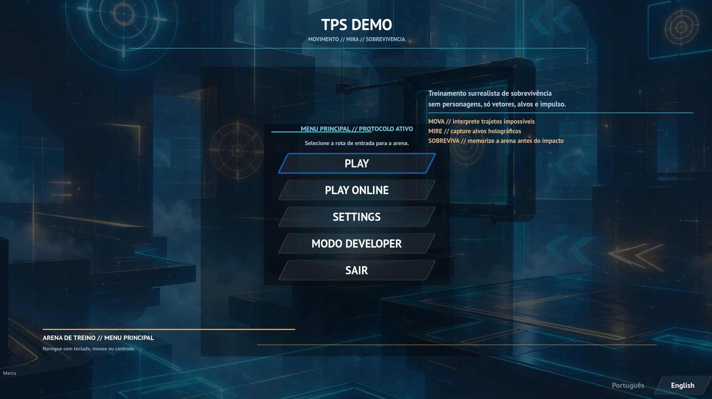

# ZIMARO

> 🇬🇧 A small third-person shooter sandbox built on the [Godot Engine](https://godotengine.org).
> 🇧🇷 Um pequeno sandbox de tiro em terceira pessoa construído sobre a [Godot Engine](https://godotengine.org).

- Help keep this project always updated 💜
- Ajude a manter este projeto sempre atualizado 💜

 &nbsp;&nbsp;&nbsp;&nbsp;&nbsp;&nbsp; 

> 🇬🇧 **This file is a high-level bilingual summary.** Full, detailed docs:
> **[📖 English → README.en-US.md](README.en-US.md)** · **[📖 Português → README.pt-BR.md](README.pt-BR.md)**
> 🇧🇷 **Este arquivo é um resumo bilíngue de alto nível.** Documentação completa e detalhada:
> **[📖 English → README.en-US.md](README.en-US.md)** · **[📖 Português → README.pt-BR.md](README.pt-BR.md)**

---

## Overview · Visão geral

🇬🇧 Built on the Godot Engine, ZIMARO is a small third-person
shooter sandbox: a menu-driven flow (character selection, level picker, settings, developer screen,
online play), playable characters that move/aim/jump/shoot, ground and flying enemies (the Red
Robot has a reactive AI that reloads faster, opens fire in range and flees when you close in),
per-limb localized damage, several levels, a browsable 3D model library, reusable cyberpunk HUD
widgets, debug tooling, EN/PT localization and live (no-Apply) settings.

🇧🇷 Construído sobre a Godot Engine, o ZIMARO é um pequeno sandbox de tiro em
terceira pessoa: fluxo por menus (seleção de personagem, seletor de fases, configurações, tela de
desenvolvedor, jogo online), personagens jogáveis que se movem/miram/pulam/atiram, inimigos
terrestres e voadores (o Red Robot tem uma IA reativa que recarrega mais rápido, abre fogo no
alcance e recua quando você se aproxima), dano localizado por membro, várias fases, biblioteca de
modelos 3D navegável,
widgets de HUD cyberpunk reutilizáveis, ferramentas de debug, localização EN/PT e configurações ao
vivo (sem botão Aplicar).

## Features · Funcionalidades

🇬🇧 Highlights: localized damage (native per-limb 3D colliders, headshots deal extra); a Models
viewer with per-category master toggles (rotation, animation, special effects, audio, colliders) and
selector dropdowns — both persisted between visits, with the drill-down chain restored on reopen; a
developer screen whose debug overlay is split into **Debug 2D** (light
yellow) and **Debug 3D** (light cyan) columns — a master alone shows nothing, each dependent line
must also be selected; a **System Health** monitor on that screen — a draggable floating panel (with a
Windows-style red close button) showing game/video/system memory, FPS and the real per-process CPU
usage (sampled from the OS, Task-Manager-like) — that alerts, beeps on each critical (>95%) spike and
force-pauses processing before a resource can freeze the machine (short CPU spikes are tolerated);
a floor grid for 3D screens; and an EN/PT localization system where **every screen carries
Português/English buttons** and each scene ships its own JSON dictionaries
(`<scene>/Resources/*.pt.json` + `*.en.json`), merged at load.

🇧🇷 Destaques: dano localizado (colliders 3D nativos por membro, headshots causam dano extra); um
visualizador Models com toggles mestres por categoria (rotação, animação, efeitos especiais, áudio,
colliders) e dropdowns de seleção — ambos persistidos entre visitas, com a cadeia de navegação
restaurada ao reabrir; uma tela developer cujo overlay de debug é dividido nas
colunas **Debug 2D** (amarelo claro) e **Debug 3D** (ciano claro) — o master sozinho não mostra
nada, cada linha dependente também precisa ser selecionada; um monitor **System Health** nessa tela
— um painel flutuante arrastável (com botão de fechar vermelho estilo Windows) com memória do
jogo/vídeo/sistema, FPS e o uso real de CPU do processo (amostrado do SO, como o Gerenciador de
Tarefas) — que alerta, emite um bip a cada pico crítico (>95%) e pausa o processamento à força antes
que um recurso possa congelar a máquina (picos curtos de CPU são tolerados); uma
malha no solo
para telas 3D; e um sistema de localização EN/PT em que **toda tela tem botões Português/English** e
cada cena traz seus próprios dicionários JSON (`<cena>/Resources/*.pt.json` + `*.en.json`),
mesclados no carregamento.

## Requirements & running · Requisitos e execução

🇬🇧 Requires **Godot 4.6.2** ([download](https://godotengine.org/download/)). Get the project from
[zimerfeld/ZIMARO](https://github.com/zimerfeld/ZIMARO) (clone or ZIP) and open it in Godot. Git
LFS is not required.

🇧🇷 Requer **Godot 4.6.2** ([download](https://godotengine.org/download/)). Pegue o projeto em
[zimerfeld/ZIMARO](https://github.com/zimerfeld/ZIMARO) (clone ou ZIP) e abra no Godot. Git LFS não
é necessário.

## Project structure · Estrutura do projeto

🇬🇧 `scenes2D/` (screens, UI, reusable widgets) · `scenes3D/` (levels + Models viewer) · `library3D/`
(3D assets by type) · `effects_shared/` (cross-character helpers) · `autoload/` (global singletons:
crash_handler, player_selection, debug_overlay, locale, system_health; Settings is
`scenes2D/settings/config.gd`) · per-scene `Resources/*.pt.json` + `*.en.json` (UI dictionaries) ·
`OBSIDIAN/` (documentation vault).

🇧🇷 `scenes2D/` (telas, UI, widgets reutilizáveis) · `scenes3D/` (fases + visualizador Models) ·
`library3D/` (assets 3D por tipo) · `effects_shared/` (helpers entre personagens) · `autoload/`
(singletons globais: crash_handler, player_selection, debug_overlay, locale, system_health; o
Settings é `scenes2D/settings/config.gd`) · `Resources/*.pt.json` + `*.en.json` por cena (dicionários
da UI) · `OBSIDIAN/` (cofre de documentação).

## Controls · Controles

🇬🇧 Move (WASD / arrows / stick), look (mouse / right stick), jump (Space), aim (RMB / L2), shoot
(LMB / R2, only while aiming), menu/quit (Escape), fullscreen (F11 / Alt+Enter), debug info (F3).

🇧🇷 Mover (WASD / setas / analógico), olhar (mouse / analógico direito), pular (Espaço), mirar
(botão direito / L2), atirar (botão esquerdo / R2, só mirando), menu/sair (Escape), tela cheia (F11 /
Alt+Enter), info de debug (F3).

## Code formatting · Formatação de código

🇬🇧 All text files use UTF-8 **without BOM**, LF endings, no trailing whitespace, and a trailing
newline — enforced by [`file_format.sh`](file_format.sh) (run `bash file_format.sh` from Git Bash).

🇧🇷 Todos os arquivos de texto usam UTF-8 **sem BOM**, quebras LF, sem espaços ao fim e com quebra de
linha final — garantido por [`file_format.sh`](file_format.sh) (rode `bash file_format.sh` no Git Bash).

## Documentation · Documentação

🇬🇧 The detailed docs ([README.en-US.md](README.en-US.md) / [README.pt-BR.md](README.pt-BR.md)) and
the [`OBSIDIAN/`](OBSIDIAN) vault are the project knowledge base and are kept up to date at the end of
every change.

🇧🇷 As docs detalhadas ([README.en-US.md](README.en-US.md) / [README.pt-BR.md](README.pt-BR.md)) e o
cofre [`OBSIDIAN/`](OBSIDIAN) são a base de conhecimento do projeto e são mantidos atualizados ao
final de cada mudança.

## License · Licença

🇬🇧 / 🇧🇷 See / Veja [LICENSE.md](LICENSE.md).

---

📖 **Full documentation · Documentação completa:** [English (README.en-US.md)](README.en-US.md) · [Português (README.pt-BR.md)](README.pt-BR.md)
